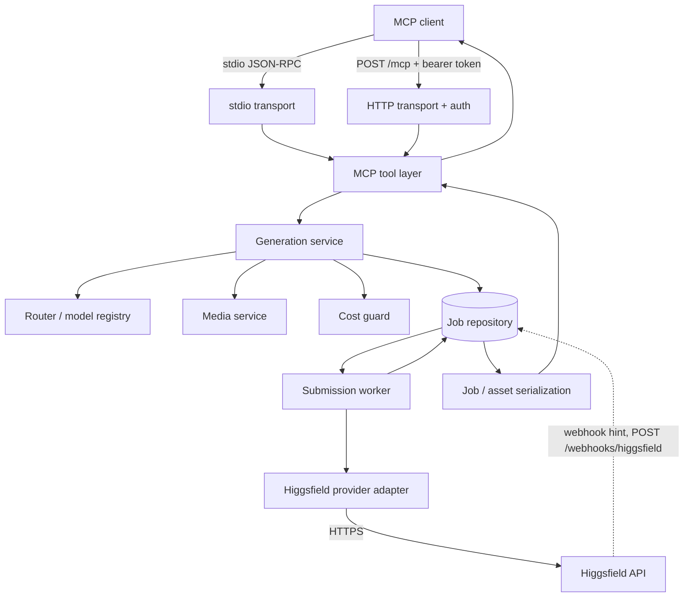

# Architecture

The gateway is a pnpm workspace that separates frozen contracts, the domain logic, the
MCP surface, the provider adapter, and the process that serves them.

## Workspace layout

| Path | Package | Owns |
|---|---|---|
| `packages/core` | `@higgsfield-mcp/core` | The frozen cross-package contracts, the domain services (generation, jobs, media, routing, submission worker, cost, rate limiting), and the repository implementations (in-memory and PostgreSQL). |
| `packages/config` | `@higgsfield-mcp/config` | Environment/config-file parsing, validation, defaults, precedence, and the tenants / rate-limits / model-aliases file schemas. |
| `packages/mcp` | `@higgsfield-mcp/mcp` | The MCP wire contract: tool input schemas, the serializer, the tool registrations, and the five resource URIs. |
| `packages/observability` | `@higgsfield-mcp/observability` | The pino logger, the Prometheus metrics registry, and the OTLP tracer. |
| `packages/provider-higgsfield` | `@higgsfield-mcp/provider-higgsfield` | The Higgsfield HTTP client, path/URL guards, status/error mapping, and the bundled model catalog. |
| `packages/skills` | `@higgsfield-mcp/skills` | The upstream skill adapter: manifest loading, patching, validation, upstream drift checks, and the skill CLI. |
| `apps/server` | `higgsfield-mcp` (published) | The `higgsfield-mcp` binary, the container composition root, both transports, HTTP auth, the webhook handler, and the CLI. |

`apps/server` is the only package that is published. `tsup` bundles every
`@higgsfield-mcp/*` package into `apps/server/dist/cli.js`, so the published tarball has no
workspace references and the CLI is a single entry point.

## Contracts

`packages/core/src/contracts.ts` and `packages/config/src/types.ts` are frozen: they are the
only cross-package interfaces, and a change there is an architectural change. The ports
defined in `contracts.ts` are:

`MediaProvider`, `ProviderFactory`, `CredentialResolver`, `ModelRegistry`, `MediaService`,
`JobRepository`, `JobService`, `GenerationService`, `SubmissionWorker`, `RateLimiter`,
`CostGuard`, `ObjectStore`, `Clock`, `LoggerPort`, `MetricsPort`.

Conventions that hold everywhere:

- Internal models are camelCase; snake_case exists only at the MCP wire boundary
  (`packages/mcp/src/schemas.ts`, `packages/mcp/src/serialize.ts`).
- Money is integer micro-USD internally; decimal strings from the provider are parsed with
  exact decimal arithmetic at the adapter boundary (`packages/provider-higgsfield/src/mapping.ts`).
- No credential material is ever placed on a job, an asset, or a log record.

## Request path

1. **Transport.** `apps/server/src/transport/stdio.ts` serves one connection per stdio pipe;
   `apps/server/src/transport/http.ts` serves `POST /mcp` through the SDK's Streamable HTTP
   handler with tenant authentication in front of it. Both build the same MCP server from
   `createGatewayMcpServer` (`packages/mcp/src/server.ts`).
2. **Tool layer.** Each tool parses and validates its input with the frozen zod schema,
   checks the required scope, calls one core service, and serializes the result. Tools hold
   no provider or transport logic; a serialization failure is reported as `INTERNAL_ERROR`
   rather than an unvalidated shape.
3. **Routing.** `packages/core/src/capabilities/router.ts` maps the semantic endpoints
   (`image.default`, `image.edit`, `video.default`, `video.image_to_video`,
   `video.reference_to_video`) onto catalog models, translating the semantic vocabulary
   (`quality: draft|standard|high`) and rejecting a field the selected model does not document.
4. **Media.** `packages/core/src/media/service.ts` is the only component allowed to read a
   local file, download a caller URL, or copy provider bytes. Generation inputs are resolved
   to provider-visible URLs before submission.
5. **Cost and confirmation.** `packages/core/src/policies/cost-guard.ts` resolves a price from
   an operator override or the provider estimate endpoint. When configured limits are active,
   an unknown price is fatal; when a price exceeds the confirmation threshold, the caller
   receives `confirmation_required` and a token instead of a submitted job.
6. **Submission.** `generation-service.ts` freezes the provider request body and its hash,
   persists a submission envelope, and returns a job. It never POSTs to the provider inline.
7. **Worker.** `packages/core/src/capabilities/submission-worker.ts` claims envelopes under a
   lease, submits them, polls non-terminal jobs with jittered backoff and per-class
   concurrency caps, and materializes provider assets. Ambiguous submissions on endpoints
   without a documented idempotency guarantee are never replayed automatically.
8. **Persistence.** `HF_MCP_DATABASE_URL` selects the PostgreSQL repository; without it the
   gateway uses the in-memory repository. `HF_MCP_REDIS_URL` does the same for rate limiting.

## Runtime data path

The webhook path is a hint only: it clears a job's poll backoff so the worker reconciles it
sooner. Provider status polling remains authoritative.

## Failure and lifecycle model

- Job status is the public union `queued | processing | completed | failed | cancelled`.
- Submission state (`pending`, `submitting`, `acknowledged`, `outcome_unknown`, `rejected`,
  `cancelled`) is persisted and never exposed; a job with an unresolved submission keeps a
  non-terminal public status.
- SIGTERM stops admission, drains in-flight HTTP requests for
  `HF_MCP_SHUTDOWN_GRACE_MS`, stops the worker, closes the repository and Redis, and exits.
  Remote provider jobs are not cancelled by shutdown; they are reconciled after restart.
- Startup runs `reconcileOnStartup()` for the configured worker so jobs interrupted by a
  restart resume polling.
